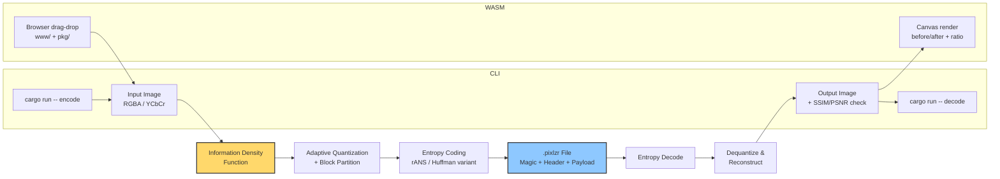
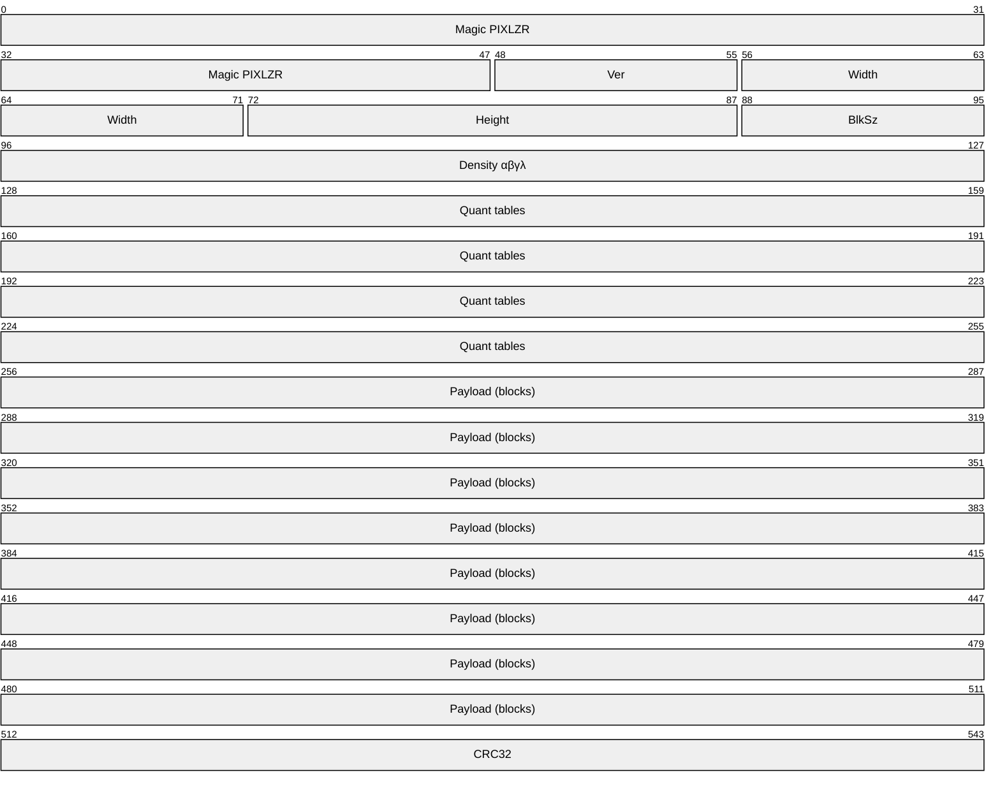
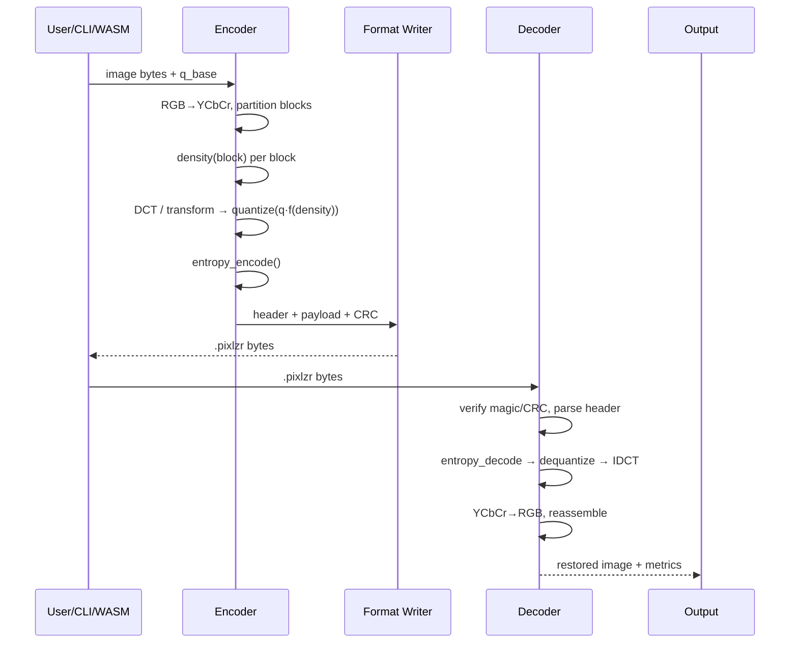

# PIXLZR Architecture

> **Audience:** hiring manager / Rust reviewer — 3-minute read that proves the codec is not just "a compressor" but a designed system with a threading model and a density rationale.

## 1. High-Level Pipeline



**Design principle:** spend bits proportional to *local information density*, not uniformly. Flat regions (sky, wall) compress aggressively; edges/textures keep detail — perceptual quality at high ratio.

## 2. Information Density Function

The core novelty. For each 8×8 (or 16×16) block:

```
density(block) = α · gradient_magnitude + β · local_variance + γ · edge_response
```

Where:

| Term | What it captures | Operator |
|------|------------------|----------|
| `gradient_magnitude` | edge strength | Sobel / Scharr on luma |
| `local_variance` | texture busyness | σ² over block vs. 3×3 neighborhood |
| `edge_response` | structural detail | Laplacian or Canny thin edge count |

Normalized to `[0,1]` per image (histogram equalization), then mapped to a **quantization multiplier**:

```
q_factor = q_base · (1 + λ · density) ^ -1   // high density → finer quant → more bits
```

- `λ` is tunable (default ~0.8) — controls density sensitivity.
- Synthetic high-density chart in `benches/data/` stresses this path (checkerboard + text overlay).

Future: replace hand-tuned α/β/γ with learned weights; keep function pure (`&[u8] -> f32`) for determinism and testability.

```mermaid
flowchart TB
    IMG[Input block 8x8 Y] --> G[Sobel Gx/Gy]
    IMG --> V[Local variance]
    IMG --> E[Laplacian edge map]
    G --> W[Weighted sum\nα·G + β·V + γ·E]
    V --> W
    E --> W
    W --> N[Normalize 0..1\nper-image histeq]
    N --> Q[Quant multiplier\nq_base · f(density)]
    Q --> ENC[Encoder bit allocation]
```

## 3. Custom Format — `.pixlzr` Layout

```
Offset  Size    Field
------  ------  -----
0       6       Magic: ASCII "PIXLZR" (0x50 49 58 4C 5A 52)
6       1       Version: u8 (current 0x01)
7       2       Width:  u16 LE
9       2       Height: u16 LE
11      1       Block size: u8 (8 or 16)
12      4       Density params: α,β,γ,λ as u8 fixed-point (or f32 LE in v2)
16      N       Quant tables (per-channel, varint length-prefixed)
...     ...     Payload: entropy-coded blocks, streamable
EOF-4   4       CRC32 (IEEE) of header+payload
```

- Payload is **block-order streaming**: decoder can render top-to-bottom without full-file buffer (important for WASM and video).
- Header is versioned — unknown version → graceful error (not panic).

Full byte-level spec → `docs/format.md` (Phase 2).



## 4. Encoder → Decoder Data Flow



- Encoder and decoder share `pixlzr-core` (no I/O, no `std::fs`) — same code path for native and `wasm32-unknown-unknown`.
- Metrics (SSIM/PSNR/ratio) computed outside the hot loop.

## 5. Threading Model

**Goal:** linear scaling to core count for 1080p encode/decode; no data races; deterministic output regardless of thread count.

```mermaid
flowchart TB
    subgraph Encode Parallel
      PART[Partition into N blocks] --> MAP[Rayon par_iter\nblock → density + quant + encode]
      MAP --> REDUCE[Order-preserving collect\n+ entropy interleave]
    end

    subgraph Decode Parallel
      STREAM[Payload stream\nchunk by block row] --> PAR[Rayon par_iter\nchunk → entropy_decode + IDCT]
      PAR --> ASSEMBLE[Reassemble rows\natomic row counter]
    end

    subgraph Video Filter 60fps
      FRAMES[Frame queue\ncrossbeam channel] --> POOL[Thread pool\nRAYON_NUM_THREADS]
      POOL --> FILTER[Per-frame: decode + filter kernel]
      FILTER --> VSYNC[Present @ 60Hz\nbackpressure if behind]
    end

    style MAP fill:#b8f7b8,stroke:#333
    style PAR fill:#b8f7b8,stroke:#333
```



Rules:

- **No shared mutable state** in block processing — each block owns its buffer; join via `par_iter().map().collect()`.
- **Rayon** thread pool sized by `RAYON_NUM_THREADS` (bench pins `8` on 8C/16T); `cargo bench` reports with/without `multithread` feature.
- Order-preserving: parallel map, sequential write — file is deterministic (`sha256` equal for same input regardless of thread count).
- WASM build disables `rayon` (no threads in `wasm32-unknown-unknown` without `SharedArrayBuffer`); single-thread fallback via `cfg(target_arch = "wasm32")`.
- Backpressure in video: if `frames_processed / wall_clock < 60`, drop non-key frames and log — bench `video_filter` asserts `≥60 FPS @1080p`.

```
Native:  cargo run --release --features multithread  (default)
WASM:    wasm-pack build --target web --no-default-features --features wasm
Bench:   RAYON_NUM_THREADS=1 cargo bench  vs  RAYON_NUM_THREADS=8 cargo bench
```

## 6. Crate Layout

```
pixlzr/
├── crates/
│   └── pixlzr-core/          # no_std-compatible core (encode/decode/density) — WASM-safe
│       └── src/{lib,encode,decode,density,format}.rs
├── src/main.rs               # CLI (clap) — thin wrapper over core
├── benches/{codec,video_filter}.rs  # criterion
├── www/  (or demo/)          # wasm-pack pkg/ + JS glue + index.html
├── docs/{architecture,format,wasm-demo-spec}.md
└── .github/workflows/{ci,pages}.yml
```

Extraction rule: everything that touches `std::fs`, `clap`, or OS threads stays out of `pixlzr-core`. Core exposes:

```rust
pub fn encode(input: &Image, params: &EncodeParams) -> Result<Vec<u8>, PixlzrError>
pub fn decode(bytes: &[u8]) -> Result<Image, PixlzrError>
pub fn density_map(luma: &[u8], width: usize, height: usize) -> Vec<f32>
```

## 7. Performance Notes

- Hot paths: density map (~15% of encode), DCT/quant (~40%), entropy (~30%) — flamegraph in `cargo bench` artifact.
- 60fps claim requires: 1080p, `RAYON_NUM_THREADS=8`, Ryzen 7 5800X-class CPU, `performance` governor — see `benches/README.md` hardware disclosure template.
- WASM is ~1.8–2.5× slower than native (measured; no threading) — acceptable for demo (<500ms for 768×512 Kodak on M1).

## 8. Roadmap Hooks

- v2 format: `f32` density params, adaptive block size quadtree.
- `wee_alloc` optional for WASM footprint.
- `cargo xtask` to fetch bench datasets with SHA256 manifest.

---

*This doc is the source for the repo social preview diagram. Export the mermaid above (first pipeline) as 1280×640 PNG → `assets/social-preview.png`.*
