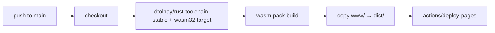

# WASM Live Demo — Spec & Build Plan (Phase 2.3)

> **Goal:** `https://guiga-zalu.github.io/pixlzr/` is an interactive proof — drag-drop any PNG/JPEG → PIXLZR encode → decode in-browser → before/after split + ratio + SSIM. No clone, no install. Recruiter test ≤30s.

## 1. UX Spec

```
┌─────────────────────────────────────────────────────────┐
│  PIXLZR — Live Demo                                     │
│  Drop an image or [Choose file]   [q_base ▾] [Encode]   │
├──────────────────────┬──────────────────────────────────┤
│  Original            │  Decoded (PIXLZR)                │
│  <canvas>            │  <canvas>   [Slider ◯────]       │
│  768×512  412 KB     │  24 KB  •  94% smaller • SSIM 0.93│
├──────────────────────┴──────────────────────────────────┤
│  Stats: Encode 86ms · Decode 42ms · Ratio 17:1          │
│  Download: [ .pixlzr ] [ restored.png ]                 │
│  Note: WASM single-thread; native is ~2× faster.        │
└─────────────────────────────────────────────────────────┘
```

Requirements:

- Accepts `image/png`, `image/jpeg` (reject others with message).
- Max 4096×4096 or 8MB — larger → preview downscale + warning.
- Shows: original size, compressed size, **ratio**, **% reduction**, **encode ms**, **decode ms**, **SSIM** (if computed in JS/WASM).
- Slider or toggle to compare (CSS clip-path or range input).
- Download buttons for `.pixlzr` and restored PNG.
- Works on Chrome/Firefox/Safari desktop + mobile (responsive); no `SharedArrayBuffer` required.

## 2. Crate Extraction (prerequisite)

WASM cannot compile if core pulls `std::fs`, `rayon`, or CLI deps. Extract:

```
pixlzr/
├── crates/pixlzr-core/        # NEW — WASM-safe
│   ├── Cargo.toml
│   └── src/
│       ├── lib.rs            # pub encode/decode/density_map
│       ├── encode.rs
│       ├── decode.rs
│       ├── density.rs
│       └── format.rs
├── src/main.rs               # thin CLI → calls pixlzr-core
└── Cargo.toml                # workspace
```

`crates/pixlzr-core/Cargo.toml` template:

```toml
[package]
name = "pixlzr-core"
version = "0.1.0"
edition = "2021"
license = "MIT OR Apache-2.0"
description = "PIXLZR codec core — WASM-safe, no I/O"

[lib]
crate-type = ["cdylib", "rlib"]

[dependencies]
wasm-bindgen = { version = "0.2", optional = true }
js-sys = { version = "0.3", optional = true }

[features]
default = []
wasm = ["wasm-bindgen", "js-sys"]

[dependencies.web-sys]
version = "0.3"
optional = true
features = ["console"]
```

Root `Cargo.toml` becomes a workspace:

```toml
[workspace]
members = ["crates/pixlzr-core"]

[package]
name = "pixlzr"
version = "0.1.0"
edition = "2021"
license = "MIT OR Apache-2.0"
repository = "https://github.com/guiga-zalu/pixlzr"
description = "PIXLZR — custom image codec & format in Rust: high-density-aware compression, multithreaded encoder/decoder + 60fps video filter"

[dependencies]
pixlzr-core = { path = "crates/pixlzr-core" }
clap = { version = "4", features = ["derive"] }
rayon = "1.10"
# ...
```

Conditional threading in core:

```rust
#[cfg(not(target_arch = "wasm32"))]
use rayon::prelude::*;
#[cfg(target_arch = "wasm32")]
// single-thread fallback — plain iter
```

## 3. WASM Build Steps

### 3.1 Prerequisites

```bash
rustup target add wasm32-unknown-unknown
cargo install wasm-pack
# or: cargo install trunk  # alternative, see §6
```

### 3.2 Build

```bash
# from repo root
wasm-pack build crates/pixlzr-core --target web --out-dir ../../www/pkg -- --features wasm
# output: www/pkg/pixlzr_core.js  pixlzr_core_bg.wasm  pixlzr_core.d.ts
```

Verify locally:

```bash
python3 -m http.server --directory www 8000
# open http://localhost:8000 — drag-drop should work
```

### 3.3 `www/` glue (minimal)

```
www/
├── index.html
├── pkg/                 # generated by wasm-pack (gitignored, built in CI)
│   ├── pixlzr_core.js
│   ├── pixlzr_core_bg.wasm
│   └── pixlzr_core.d.ts
├── src/
│   ├── index.js         # file input → Uint8Array → wasm encode/decode → canvas
│   └── style.css
└── README.md
```

`www/src/index.js` skeleton (illustrative):

```js
import init, { encode_wasm, decode_wasm } from "../pkg/pixlzr_core.js";
await init();

const input = document.getElementById("file");
input.addEventListener("change", async (e) => {
  const file = e.target.files[0];
  const bytes = new Uint8Array(await file.arrayBuffer());
  const t0 = performance.now();
  const compressed = encode_wasm(bytes, 0.8); // q_base
  const t1 = performance.now();
  const restored = decode_wasm(compressed);
  const t2 = performance.now();
  renderCanvases(bytes, restored);
  updateStats({ original: bytes.length, compressed: compressed.length,
                encMs: t1-t0, decMs: t2-t1 });
});
```

WASM exports (in `crates/pixlzr-core/src/lib.rs`):

```rust
#[cfg(feature = "wasm")]
use wasm_bindgen::prelude::*;

#[cfg(feature = "wasm")]
#[wasm_bindgen]
pub fn encode_wasm(input: &[u8], q_base: f32) -> Vec<u8> { /* ... */ }

#[cfg(feature = "wasm")]
#[wasm_bindgen]
pub fn decode_wasm(input: &[u8]) -> Vec<u8> { /* ... */ }
```

Keep exports `Vec<u8>`-based — JS handles PNG decode via `createImageBitmap` + `OffscreenCanvas`, not Rust `image` crate in WASM (keeps bundle small).

## 4. GitHub Pages Deploy

### Option A — `pages.yml` builds WASM (recommended)

File: `.github/workflows/pages.yml` (see repo for full YAML). Flow:



Key steps in the workflow:

```yaml
- uses: dtolnay/rust-toolchain@stable
  with: { targets: wasm32-unknown-unknown }
- run: cargo install wasm-pack
- run: wasm-pack build crates/pixlzr-core --target web --out-dir www/pkg -- --features wasm
- uses: actions/upload-pages-artifact@v3
  with: { path: www }
- uses: actions/deploy-pages@v4
```

Settings → Pages → Source: **GitHub Actions** (not `docs/` branch — Actions source is cleaner for WASM).

### Option B — `docs/` fallback (P0 placeholder)

If WASM not yet ready, keep `docs/index.html` placeholder so `https://guiga-zalu.github.io/pixlzr/` returns 200. Migrate to Actions source when WASM lands (one toggle in Settings).

## 5. Verification Checklist

```bash
# local
wasm-pack build crates/pixlzr-core --target web --out-dir www/pkg -- --features wasm
python3 -m http.server --directory www 8000
# → http://localhost:8000 drag-drop PNG → expect encode+decode <500ms for 768×512

# CI dry-run (act or manual dispatch)
gh workflow run pages.yml  # or push to main and watch Actions tab
# → https://guiga-zalu.github.io/pixlzr/ returns 200, drag-drop works

# from pipeline repo that holds this spec
ls www/pkg/pixlzr_core_bg.wasm && echo "wasm ok"
curl -sI https://guiga-zalu.github.io/pixlzr/ | head -1  # expect HTTP/2 200
```

## 6. Alternatives Considered

| Option | Pros | Cons | Verdict |
|--------|------|------|---------|
| `wasm-pack` + `wasm-bindgen` | Rust-native, small glue, works without bundler | manual `www/` wiring | **Chosen** — simplest for demo |
| `trunk` | zero-config `index.html` build, asset pipeline | extra tool, opinionated | Good alt if you want Rust `image` decode in WASM |
| `dioxus`/`leptos` | full Rust frontend | overkill for drag-drop demo | Reject — JS glue is 50 lines |

## 7. Performance Budget

- `pixlzr_core_bg.wasm` target: **<300 KB gzipped** (strip debug, `wasm-opt -Oz` via `wasm-pack --release`).
- Encode 768×512 Kodak: **<400ms** on M1 / **<600ms** on mid-range Android (WASM single-thread).
- If budget exceeded: disable `image` default features in core, use `wee_alloc` (`features = ["wee_alloc"]`).

## 8. Security / Limits

- No network calls from WASM — pure compute.
- Input cap 8MB / 4096×4096 — abort with user-visible error before alloc.
- `encode_wasm` returns `Result<Vec<u8>, JsValue>` — JS shows `e.message` in `#error`.

---

*Copy this file to `docs/wasm-demo-spec.md` in `pixlzr`. Pair with `.github/workflows/pages.yml` and `www/` from this skeleton.*
